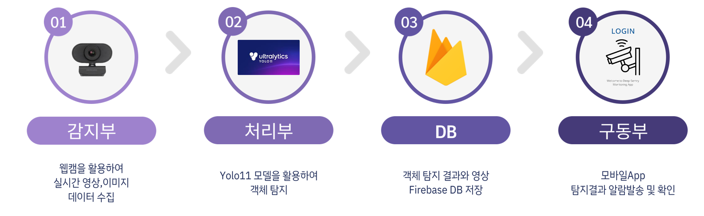
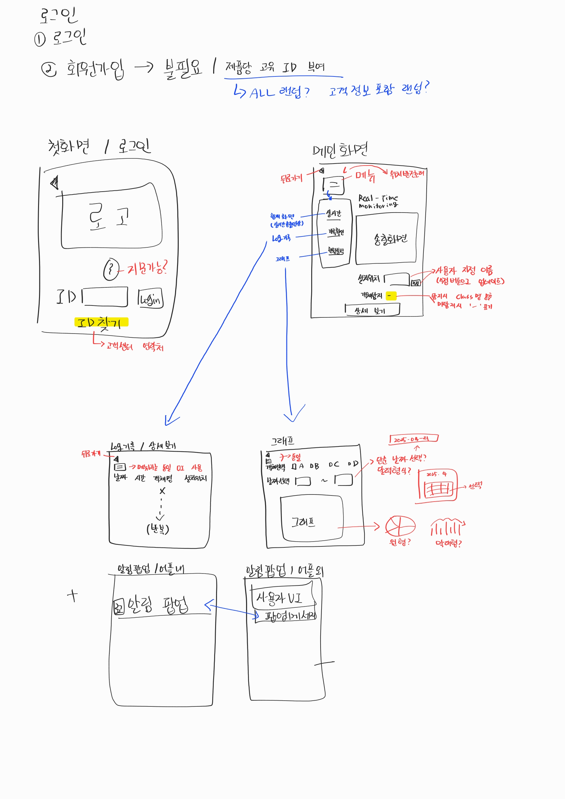
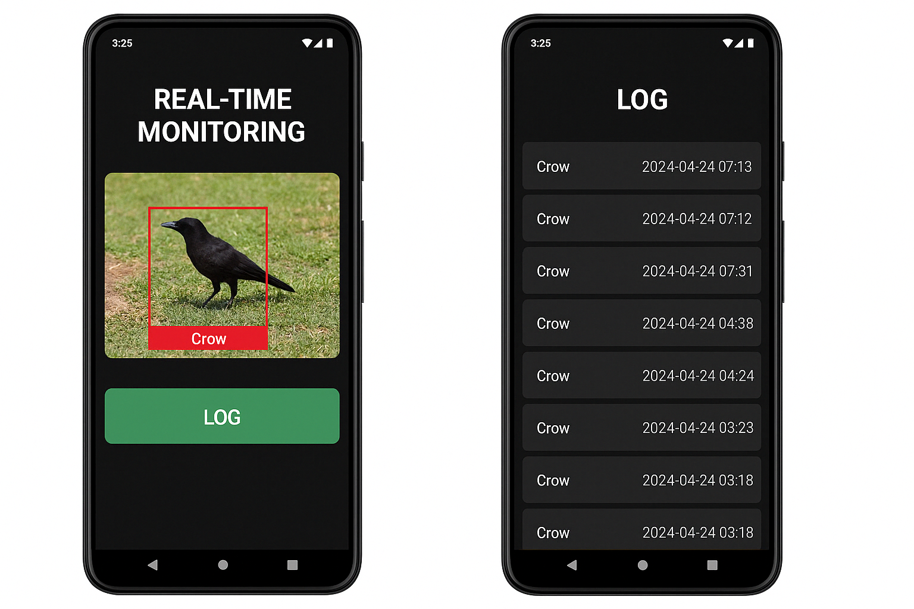
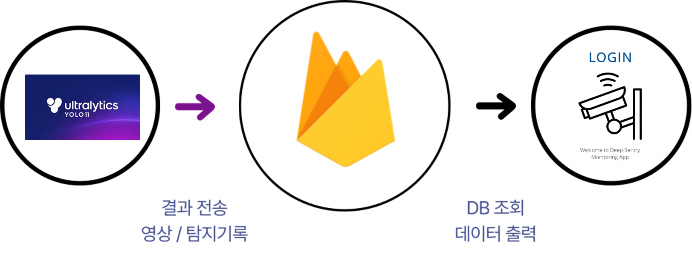
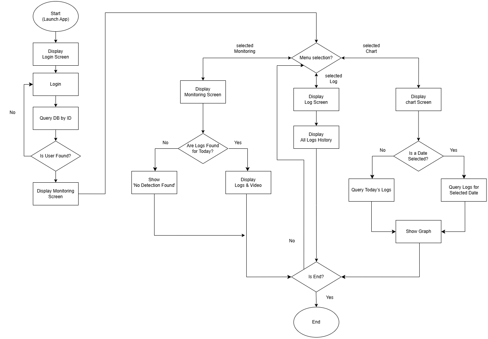
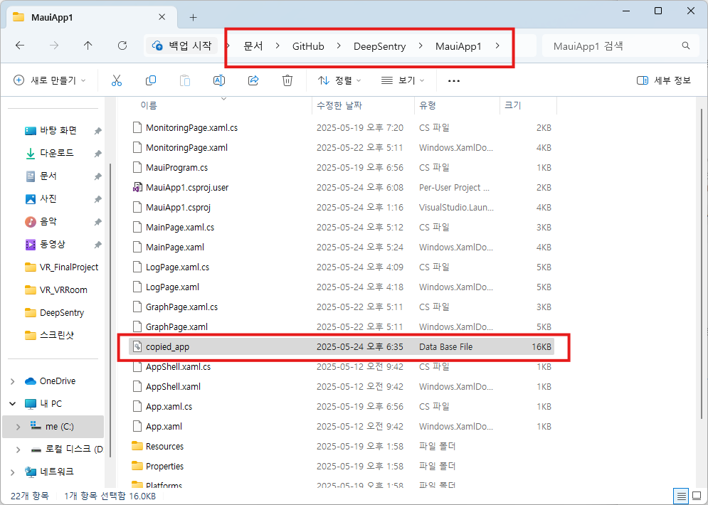
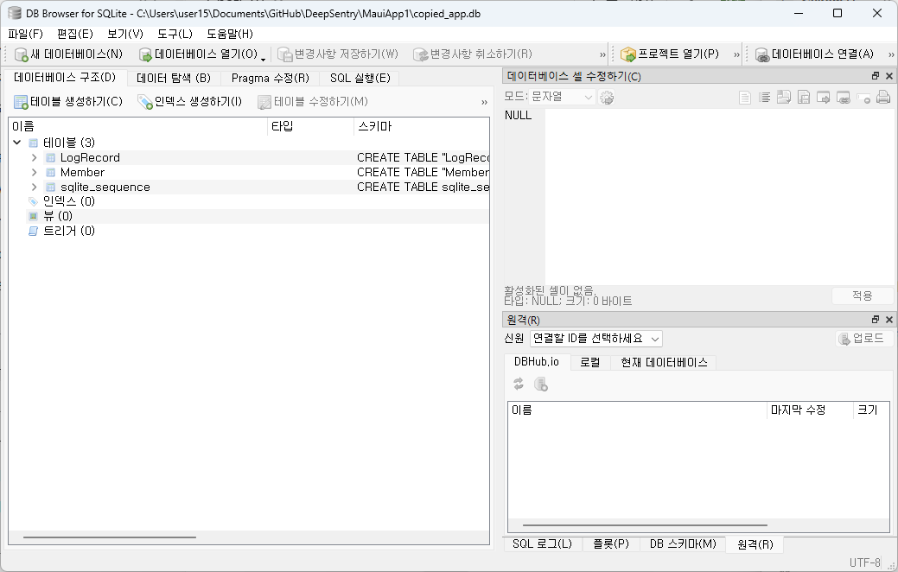
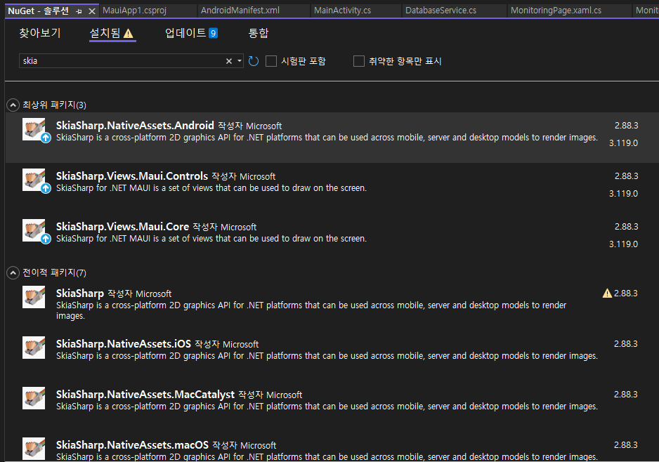

# 📒 [Notion Page](https://www.notion.so/DogShelter-20b73547a88280e9a428d5b2226c4a02)

⚙️ Dev Setup
<details>
✅ S/W_모바일 어플리케이션</br>
⚙️ C#</br>
⚙️ XAML</br>
⚙️ Visual Studio 2022</br>
⚙️ .NET MAUI(net 8.0)</br>
⚙️ Microcharts(1.0.0)</br>
⚙️ SkiaSharp(2.88.3)</br>
⚙️ MediaElement(4.1.2)</br>
</br>
✅ S/W_Yolo 객체 인식</br>
⚙️ VS Code</br>
⚙️ YOLOv11</br>
⚙️ Labelme2yolo</br>
⚙️ OpenCV</br>
⚙️ Scikit-learn</br>
⚙️ 기타 : uuid, threading</br>
</br>
✅ DB</br>
⚙️ Firebase_FireStore Database</br>
⚙️ Firebase_Storage</br>
</br>
✅ OS / Tools</br>
- Windows11</br>
- Drow.io</br>
</details>

# DeepSentry



프로젝트 소개 : 
이 시스템은 AI 객체 인식 기반의 YOLO 모델을 활용하여 유해야생동물을 실시간으로 탐지하고 대응하는 기술을 제공합니다. YOLO로 탐지된 정보를 시각화하고 실시간 경고를 제공하는 모바일 애플리케이션을 직접 개발하여, 사용자가 현장 상황을 즉각적으로 파악하고 신속하게 대응할 수 있도록 지원했습니다. 이를 통해 농작물 피해를 최소화하고, 효율적인 관리 및 경고 서비스를 제공함으로써 농업 현장의 안전성과 생산성을 높이는 것이 본 프로젝트의 핵심 목표입니다.


### **기술 선정 이유**
✅ YOLOv11 (Python)
- **단일 단계 검출 기반의 실시간성**
- **최신 모델 기반의 탐지 정확도**
- **시스템 연동성과 확장성**

✅ .NET MAUI (C# & XAML)
- **기존 개발 경험의 연속성**
- **크로스 플랫폼 빌드 지원**
- **UI/UX 구현의 익숙함(마크업 언어 기반의 구조로 학습 용이)**
- **Firebase 연동 용이성**
- **기술자료는 적었지만, 문제 해결 가능성 확보**

✅ Firebase (DB)
- **클라우드 기반 아키텍처**
- **다양한 SDK 및 개발 환경과의 호환성**  
- **정형 및 비정형 데이터의 효율적 처리**  
- **NoSQL 기반의 경량화된 데이터 처리 모델**  

### 아키텍처 구조


1. 스토리보드 / 화면설계서



초안



목업 이미지

2. FlowChart

1. 처리부_Yolo11 객체 인식
    
    
    
2. DB
    
    
    
3. 구동부_모바일 어플리케이션



## **담당역할**

- 반응형 모바일 어플리케이션 개발 총괄(.NET MAUI 기반)
    - 어플리케이션 아키텍처 설계
    - 실시간 알림 기능 구현
    - 탐지 결과에 따른 영상 출력 구현
    - 전체 객체 탐지 기록 확인 페이지 구현
    - 객체 탐지 현황 chart 구현
- AI 학습용 데이터셋 수집(공개 데이터셋 수집, 학습 클래스 정의)
- Database 기반 DB 설계 및 MAUI 연동(DB 구조 설계 및 데이터 흐름 정리)
- YOLO 탐지 결과 → Firebase 저장 포맷 설계 및 일부 구축

### 주요 기능

✅ 처리부_Yolo11 객체 인식을 통한 유해동물 식별
- 웹캠 입력 영상을 통해 실시간으로 탐지하고, 2초 이상 감지된 객체는 자동으로 영상 녹화
- 녹화된 영상 및 탐지 정보를 DB(Firebase Storage와 Firestore)에 자동 업로드

✅ 구동부_로그인 관리
- FireStore Database와 연동하여 존재하는 ID인지 확인, 추후 탐지내역 조회에 사용
- 아이디 저장 기능을 제공으로 편의성 강화 (정상 : 메인화면 진입 / 비정상 : 안내팝업 출력)

✅ 구동부_탐지 내역 실시간 모니터링
- 고정형 CCTV 4대의 탐지내역이 존재하는 경우 탐지 당시의 영상(8~10초)가 출력
- 영상 하단에 각 CCTV별 탐지 정보 출력
- 기록이 없는 경우 빈 화면과 ‘기록 없음’ 표기
- 하단 Chart를 활용하여 객체별 당일 탐지 건수에 대한 통계자료 시각화.

✅ 로그 기록 확인
- ID를 기준으로 전체 탐지 기록을 시간순으로 로그 형식 제공(일자 / 시간 / 탐지동물 / 위치)
- 페이징 기능 탑재

✅ 객체 탐지 현황 분석을 위한 chart 제공
- 초기 값은 어플 실행 당일(1일) 로그데이터를 기준으로 chart 출력
- [라디오] 버튼을 이용해서 조회 기간 설정
- [직접선택] 시 [datepicker] 버튼을 활성화하고 사용자가 원하는 기간을 직접 지정 가능

### 트러블 슈팅 (1/2)
<details>
    🚨 문제 배경
    
    DB 선택 과정에서 경량화되고 Mobile 환경에 최적화된 SQLite를 선택. 테이블을 구축하고 더미데이터를 넣어 정상적으로 DB가 구축 된 걸 확인하였으나 .db 파일의 저장 경로 확인 불가.
    YOLO에서 탐지 기록을 저장하기 위해서는 .db 파일의 위치와 저장 방법을 고려해야 했고, 해당 파일을 다시 MAUI App에서 읽어와야 했고, 그에 따른 새로운 문제점이 지속적으로 발생함.
    (로컬서버(FTP)구축, 저장방식, 실시간성 등)
    
    💡 해결방법
    
    추후 Jecson Nano등 H/W 환경이 구축되면 로컬서버가 필요하고, 메인PC 겸용으로 사용 가능.
    그러나 현재 프로토타입은 H/W 구축이 불가하고, 실시간성을 위해 클라우드방식의 Firebase로 DB 변경.
    
    1. SQLite 환경에서 data 업데이트 방식
        1. IDE에서 [adb prompt] 실행  - [.db] 파일을 내보내기 위한 명령어 실행
        
        
        
        명령어 실행시 프로젝트 폴더에 새로운 data file이 복사되어 내보내진걸 확인 가능
        
        
        
        SQLite 프로그램에서 .db 파일을 수기로 읽어와야하는 복잡한 방식
        
    2. DB 변경(SQLite → Firebase)
    
    <aside>
    💡
    
    현재 .db파일은 adb prompt를 활용해서만 내보낼수 있음(코드 불가)
    
    → 수동으로 내보내고 불러와야 하는 단점이 있음.
    
    해결방안
    1. 로컬환경(FTP)을 구축해서 공유하는 방법
    → 로컬환경서버가 되는 PC가 꺼져있으면 저장이 안됨.
    젯슨나노 등의 보드를 로컬환경으로 활용하고 계속 켜두는 방법이 좋음
    2. 구글 드라이브등의 서버를 구축 → 유료 혹은 복잡함.
    3. Firebase 클라우드 기반이며 정형,비정형 데이터 기 가능
    
    </aside>
    
    <aside>
    💡
    
    변경사유
    
    1. SQLite는 가볍지만 2인 이상 작업의 경우 ’서버’가 필요함.
    2. FireBase의 경우 클라우드
    
    | 항목 | SQLite | FireBase |
    | --- | --- | --- |
    | 패키지 | sqlite-net-pcl | Google.Cloud.Firestore |
    | 키여부 | 내장db | 비밀키필요 |
    | 호환성 | 로컬서버로 내보내야 가능 | 실시간 클라우드 연동 가능 |
    |  |  |  |
</details>

### 트러블 슈팅 (2/2)
<details>
    
    🚨 문제 배경
    
    Chart를 사용하기 위한 패키지인 Microcharts.Maui와 SkiaSharp 패키지 설치 과정에서 버전충돌, 리소스를 못 찾는 문제점이 발생
    
    💡 해결방법
    
    Package 버전 설정 : MAUI net 8.0 환경과 호환되는 Package 버전 탐색
    
    1. SkiaSharp [SKCanvasView] 사용시 Android 스타일 리소스가 추가되어야하며, 종종 누락되는 오류 발생 → 패키지 설치를 확인하거나 누락방지 설정을 수기로 추가해주어야함
    ```
    xml
    <PropertyGroup>
      <AndroidUseLatestPlatformSdk>true</AndroidUseLatestPlatformSdk>
      <AndroidEnableSkiasharpSupport>true</AndroidEnableSkiasharpSupport> <!-- 이 줄 추가 -->
    </PropertyGroup>
    ```
    
    
    1. 오류 지속되어 SkiaSharp 관련 패키지 전체 삭제 후 최신 안정버전(3.119.0) 설치
    2. MicroChart와 호환하려면 SkiaSharp(2.88.3)을 사용해야함. **(Chart 패키지끼리의 충돌)**
        
        
        
    
    Resources는 자동으로 추가가 되는 요소이나, MAUI 불안정성으로 수기 기재가 필요.
    
    1. SkiaSharp 관련 패키지 최신버전으로 업데이트
    → MicroChart와 호환성 문제 발생
    2. NuGet 캐시 삭제
    → 리소스 충돌 원이이 될 수 있다고 해서 임시 캐시 삭제.
    → bin, obj 등 프로젝트 내 임시 캐시 폴더도 삭제 후 재시도
    3. 잘못된 필드 토큰여부 확인
    4. Platforms/Android/Resources/values/attrs.xml 파일에 접근하여 리소스 직접 추가
</details>
